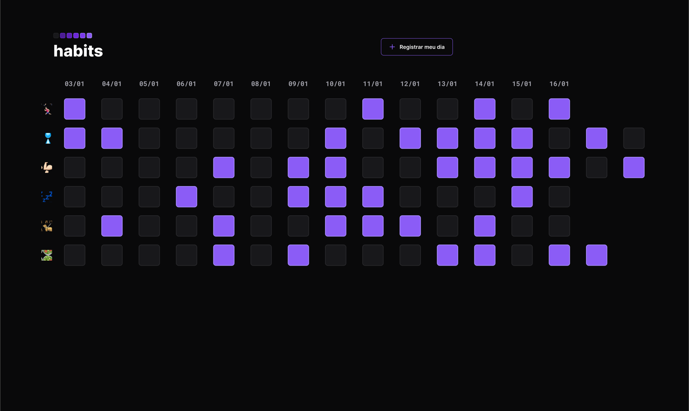

<h1 align="center">Habits@NLW</h1>

Habits é uma aplicação web desenvolvida durante a NLW (Next Level Week) da Rocketseat, que permite ao usuário acompanhar seus hábitos graficamente, adicionando um dia de cada vez e marcando nas caixinhas se cumpriu os objetivos configurados, no caso, exercício, alimentação saudável, se hidratar, ler um livro e tomar seus remédios.

[Clique aqui para visitar o projeto](https://milaholanda.github.io/NLWHabits)

<b>Este projeto foi desenvolvido com as seguintes tecnologias:</b>
- HTML
- CSS
- JS
- Git & GitHub
- Figma

<b>Visualize o projeto no Figma [AQUI](https://www.figma.com/file/6nzcJC7f02XZ4LkprkR3O7/Habits-(e)-(Community)?node-id=75%3A567&t=b0MJ9RCTJn0qlr78-0)</b> É necessário ter conta no Figma! [Crie aqui!](https://www.figma.com)